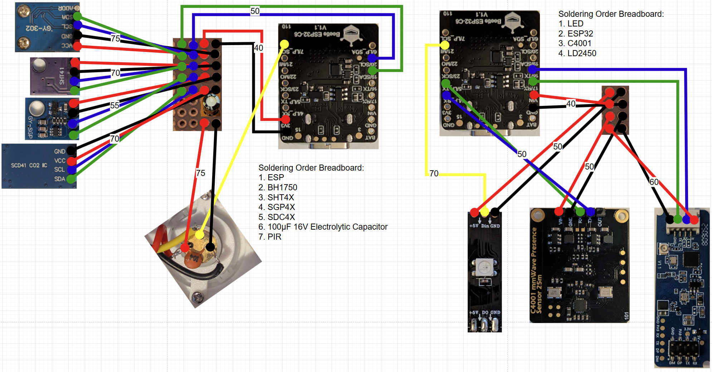
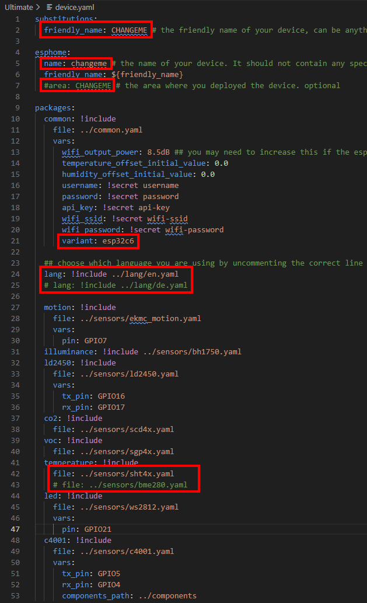

## 🔢 Steps

1. Source all the parts from the shopping list
1. Print the enclosure
1. Solder all sensors to the ESP
1. Flash the ESP with the software and verify that all sensors work (connect it to your Home Assistant instance to monitor them).
1. Assemble the sensors and ESP into the enclosure.
1. Place the device in its designated spot.
1. After a few minutes, calibrate the sensors and re-flash the software.
1. Create your Home Assistant automations using the sensors.

### 🛒 Shopping List

You can also buy the parts from other sites. If you don’t mind waiting, AliExpress is usually cheaper. I’ve listed the exact products I used because I can confirm they worked for me.

| Name | Hint | Link |
| ----- | ------ | ------ |
| ESP32 Super Mini | You can use ESP32-C6 or S3 (it is not advisable to use the C3) | [DFRobot ESP32-C6](https://www.berrybase.de/en/dfrobot-beetle-esp32-c6-wifi-6-bluetooth-5-zigbee-3.0-thread-risc-v-13-io-ports-3.3v)   [ESP32-C6 Super Mini](https://de.aliexpress.com/item/1005009089500839.html?spm=a2g0o.order_list.order_list_main.17.51e45c5fZesJEf&gatewayAdapt=glo2deu) (you must choose the correct variant, as the link does not include the choice) |
| Power Supply (PSU) | Any low-power PSU you already have should work. Otherwise, buy a simple one. | [Amazon](https://www.amazon.de/dp/B0D7MD5BJ3?ref=ppx_yo2ov_dt_b_fed_asin_title&th=1) |
| Temperatur Sensor SHT4x or BME280 | I decided to use the SHT41 as it's temperature sensor is more accurate.   The BME280 is also supported when you need to measure air pressure. | [BME280](https://amzn.eu/d/04BAvHum)   [SHT4x](https://de.aliexpress.com/item/1005008518326181.html?spm=a2g0o.order_list.order_list_main.29.51e45c5fZesJEf&gatewayAdapt=glo2deu) |
| Screws | 8x M2x3mm | [Amazon](https://www.amazon.de/dp/B0CZNT5YXV?ref=ppx_yo2ov_dt_b_fed_asin_title&th=1) |
| Brightness Sensor BH1750 | Worked flawlessly for me in V1 and V2 so it is back in the Ultimate | [Amazon](https://www.amazon.de/dp/B0D3WN41FS?ref=ppx_yo2ov_dt_b_fed_asin_title) |
| Motion Sensor Panasonic EKMC 1603111 | Theoretically other Panasonic PIRs would be also compatible if they have the same form factor. | [Aliexpress](https://de.aliexpress.com/item/1005006704410099.html?spm=a2g0o.order_list.order_list_main.11.51e45c5fZesJEf&gatewayAdapt=glo2deu) |
| Presence Sensor LD2450 | Pay attention that the one you buy includes the cable as it easier to work with. | [Amazon](https://www.amazon.de/dp/B0FMRQ6DWJ?ref_=ppx_hzod_title_dt_b_fed_asin_title_0_0) |
| Presence Sensor C4001 | Unfortunately this sensor is sometimes hard to source in germany. | [DigiKey](https://www.digikey.de/de/products/detail/dfrobot/SEN0609/23028638) |
| Cables | I used 22 AWG wire | [Aliexpress](https://de.aliexpress.com/item/1005007671008743.html?spm=a2g0o.order_list.order_list_main.227.23775c5f0Fhk0S&gatewayAdapt=glo2deu) [Amazon](https://www.amazon.de/dp/B0FDKT9XPV?ref_=ppx_hzsearch_conn_dt_b_fed_asin_title_1&th=1) |
| Long USB Cable | Choose length to fit your setup. | [Aliexpress](https://de.aliexpress.com/item/1005007053181899.html?spm=a2g0o.order_list.order_list_main.262.23775c5fsHIXLm&gatewayAdapt=glo2deu) |
| Filament | I printed my case in Kingroon White PLA and with Kingroon White PETG. You can use bambu labs filament of course. I printed the brightness sensor cover out of translucent PLA/PETG. | [Kingroon Filament](https://de.aliexpress.com/item/1005007226921275.html?spm=a2g0o.order_list.order_list_main.29.51fa5c5fMbjQzg&gatewayAdapt=glo2deu) [Elegoo Transparent PLA](https://www.amazon.de/dp/B0CD7BS7B1?ref_=ppx_hzsearch_conn_dt_b_fed_asin_title_8) [eSUN Clear PETG](https://www.3djake.de/esun/petg-clear-5) |
| Cable Distribution (Proto Boards) | I broke something off proto boards and used that to distribute the cables which needed to go to multiple sensors. | [Amazon](https://amzn.eu/d/0a2D7E1M) |
| Status LED | I used an LED from leftovers of an WS2812 LED strip with 5V that I got laying around | [Amazon](https://amzn.eu/d/04rXpC34) |
| 100µF 16V Electrolytic Capacitor 100nF (104) Ceramic Capacitor | The capacitors are used to suppress interferences that may be injected by the ESP32 into the power rails.  This measure was taken to improve the reliability of the PIR sensor and remove false positives as much as possible. It is recommended by Panasonic to do so. I got pretty good results without them but I wanted the best possible experience and your mileage may vary if you omit them. | [Amazon](https://www.amazon.de/dp/B0DXC7MX53) |

You also need:

- A soldering iron (and soldering skills)
- Solder
- Wire stripping tool
- Side cutters to trim the cables
- Screwdriver
- Pliers
- Desoldering pump (optional)
- Multimeter (optional if you trust your soldering skills)

### 🔢 Assembly Instructions

1. Desolder all the pin headers if there are any on your purchased sensors
    - Remove the pin spacers with pliers.
    - Clamp the sensor in a vise.
    - Desolder and remove the pins. It’s also possible to heat the solder and pull the pins with pliers without a desoldering pump.
1. Break a **7x4** matrix from the proto board
    I used carpet knife to cut around the matrix on the proto board on both sides and used pliers to carefully break the proto board at the cut.

    
    
    
    
    
    

1. Break a **5×2** matrix from the proto board
    Using the same technique as above.
1. Cut wires to length. I wrote the length of the cables in mm into the connection drawings. I show the two distribution boards separately to make things easier to follow. (There are further steps below on soldering order.) For the generic ESP32-C6 Super Mini the wiring differs in one aspect from the DFRobot Beetle as it only got one ground pin.
    - I only got 5 colors of cables
        - red = Voltage (If you have more colors use different colors for 3.3V (BME280/BH1750/SGP4x/SHT4x/SCD4x/PIR) and 5V(LD2450/C4001/LED), It is important to never mix them up)
        - black = Ground
        - Green = I2C SCL/UART (If you have more colors you can use different colors for UART and I2C)
        - Blue = I2C SDA/UART (If you have more colors you can use different colors for UART and I2C)
        - Yellow = Motion Out / Status LED Data In
    - **DFRobot Beetle ESP32-C6**
        
    - **Generic ESP32-C6 Super Mini**
        
1. Make sure to tin the wire ends
1. Solder one end of each wire to the sensors as described in the Connection Drawings from Step 4
    - PIR Sensor:
        - First place the printed round PIR bracket on the sensor as this can't be done when the sensor is already soldered together
        - The middle pin is the data pin
        - also solder the 100nF ceramic capacitor between the ground and the voltage pin
    - Presence Sensor LD2450:
        - **The colors of the included cable are different to the drawings. The cable may have different colors on your version. Pay attention to correctly wire every pin to the correct location. The pins are labeled on the board.**

    | PIR Sensor | Presence Sensors | BH1750 |
    | ---------- | ---------------- | ------ |
    |  |  |  |

    | SHT41 | SCD41 | SGP40 |
    | ----- | ----- | ----- |
    |  |  |  |

1. Solder the **other end** of the wires to the **distribution proto boards and ESP respectively. Connect wires of the same color together.** If you used a proto board where the lines are already connected via the board you don't need to do any extra step. My proto board has separated solder points so I had to bridge them.

    
    
     
    
    
    

1. **Solder the wires to the ESP pins** as described in the connection drawings above. You need to attach the cables from the back side (because the wifi antenna is on the front and we want that to be facing away from the motion sensor) — attach them as shown in the photos.

    
    
    

1. Use a **multimeter** to verify that solder joints of different colors do not bridge. Any short can damage components and may cause smoke or even fire.
1. Now it's time to check whether all the soldering has worked out. Flash the software onto the ESP. It can be found in the software section. Verify that all sensors are detected and reporting, then return here to complete assembly.
1. Attach the ball head mount to the back of the case

    
    
    

1. Place all the sensors, boards and ESP in place using M2x3mm screws
    The order does not really matter but it is easiest to do it in the order depicted in the photos here:

    
    
    
    
    
    
    
    
    
1. The case for the temperature sensor is used to hold it in place as well as shield it a bit from the heat produced by the other components
1. The SGP30 and SCD4X sensors do have shields that slide on to secure them in place
1. Attach the USB cable.
1. Close the lid — it **snaps** into place.

**Congratulations — you’re done!** 🥳🎉
Post a picture and a comment to this model — I’d love to see your results 🤗

### 💾 Software

This project uses [ESPHome](https://esphome.io/) as the underlying software. It’s easy to set up and flash. You need a single YAML file that defines the sensors connected to the device and their properties. I won’t provide general ESPHome flashing instructions — the official documentation is excellent:
Guide: <https://esphome.io/guides/installing_esphome/>

1. Download the source code from [my GitHub](https://github.com/DerGary/all-in-one-sensor-device/archive/refs/heads/main.zip)
1. Extract the zip file
1. Navigate to the Ultimate Folder
1. There is a device.yaml. You can copy the file multiple times and name it differently if you want to create multiple devices.
1. Adapt the device.yaml file as needed.
    - Change the friendly name, name, and optionally the area to your liking.
    - When you are using the S3 or another variant you have to change the variant. Possible values are: 'ESP32', 'ESP32C2', 'ESP32C3', 'ESP32C5', 'ESP32C6', 'ESP32C61', 'ESP32H2', 'ESP32P4', 'ESP32S2', 'ESP32S3'.
    - Uncomment/comment out the includes for the language package and the sensor that you are using.

    

1. In **secrets.yaml**, set wifi-password and wifi-ssid to your Wi-Fi credentials.
1. Set the password and username to any values you like. If you create multiple devices you should set unique values for each of the device and rename the secrets to reflect that.
1. Set the api-key to a value generated via the website: <https://esphome.io/components/api/#configuration-variables>. This value is used to add the device to home assistant. If you create multiple devices you should set unique values for each of the device and rename the secrets to reflect that.
1. Connect the device via USB to your computer.
1. Run ‘esphome run device.yaml’ to flash the device.
1. Test whether all sensors work as expected.
1. Once deployed in its final location, proceed with calibration.

### 🎯 Calibration

Calibration is **non-trivial** and may take time and multiple iterations. I mainly use **offset calibration**, which is the easiest approach, though there are more accurate methods also available. If you mount the sensor high in the room (which improves presence detection) it will decrease the accuracy of the temperature sensor as hot air rises up. When you mount it high in the room you should use linear calibration to calibrate the temperature sensor.

**BME280 / SHT4X**:

I only calibrated **temperature** and **humidity**. I don’t use air pressure

Let the device sit for **5–10 minutes** to heat-soak.

Place a trusted sensor nearby.

Calibrate humidity and temperature using the input components **Temperature Offset** and **Humidity Offset** directly in Home Assistant.

**LD2450 Presence Sensor:**

The LD2450 can't be calibrated. But you can configure up to three zones. The zones can be configured in the HLKRadarTool Android / iOS App.

**C4001 Presence Sensor:**

The C4001 Sensor got a couple of settings that can be changed. You can find the settings in the config section in Home Assistant. The main settings to calibrate are:

- Sustain / Trigger Sensitivity
  - The C4001 millimeter wave proximity sensor has two sensitivities: trigger sensitivity and hold sensitivity. Trigger sensitivity refers to the ease of triggering the sensor when entering the sensing area. Hold sensitivity refers to the sensitivity of continuous detection of the target after the sensor is triggered. Both trigger and hold sensitivities have 10 levels, with higher numbers indicating higher sensitivity and lower numbers indicating lower sensitivity. The default sensitivity value is 7
  - Note: Please configure the sensitivity according to the actual usage environment and requirements. Lower sensitivity requires larger movement amplitude and closer distance of the target to be detected. Higher sensitivity requires a higher demand for environmental interference. If there are interferences, it is more prone to false alarms. Setting the trigger sensitivity to 8 or 9 may cause a certain probability of false alarms, and it is mainly used in scenarios where false alarms are not sensitive. Generally, it is recommended to configure the trigger sensitivity between 2 and 6, with a value range of 0 to 9.
- Min / Max Distance
  - 0.6-25 meters
- Trigger Distance
  - The trigger distance of the C4001 millimeter wave presence sensor refers to the distance at which it can trigger from no one to someone. For example, if the maximum detection distance is configured as 10 meters, and the trigger distance is set to 6 meters, the sensor will only display "someone" when someone is within 6 meters. If someone is between 6-10 meters, it will not be triggered as "someone". The trigger distance can be set within the range of 0-25m, with a default of 6m.
  - Note: Configuring the trigger distance can optimize the problem of false triggering caused by slight movements at the edge. The smaller the trigger distance, the closer you need to be to the center axis of the sensor to trigger it. The trigger distance value cannot be greater than the difference between the maximum and minimum detection distances

### 🎯 Placement Considerations

1. When you mount the sensor high in the room it will improve presence sensing, but decrease temperature readings. Hot air rises and will skew and destabilize temperature readings.
1. Don’t place the device near a heater — it reduces temperature accuracy and can trigger the motion sensor.
1. Don’t place it directly in strong airflow (e.g., when airing the room), as the motion sensor detects rapid heat changes.

### 📢 Tips

- You can use the [underware collection](https://makerworld.com/de/models/783010-underware-2-0-infinite-cable-management?from=search#profileId-1504508) to route your cables.
- You can use [my cable clamps](https://makerworld.com/de/models/1744421-adhesive-cable-clamp-for-usb-cables-4mm-3mm#profileId-1853998) to route USB cables. They fit the cables linked here, use minimal filament, and can be attached with double-sided tape.
- You can use [my collection of ball head mounts](https://makerworld.com/de/collections/9129741-ball-head-mounts) to mount the device to cabinets, tubes, walls, desks etc.
- It’s preferable to position the device **facing the area where you stay** rather than just facing the door. The motion sensor has a wide field of view and covers most of the room, while the presence sensor works best when pointed directly at the target.
